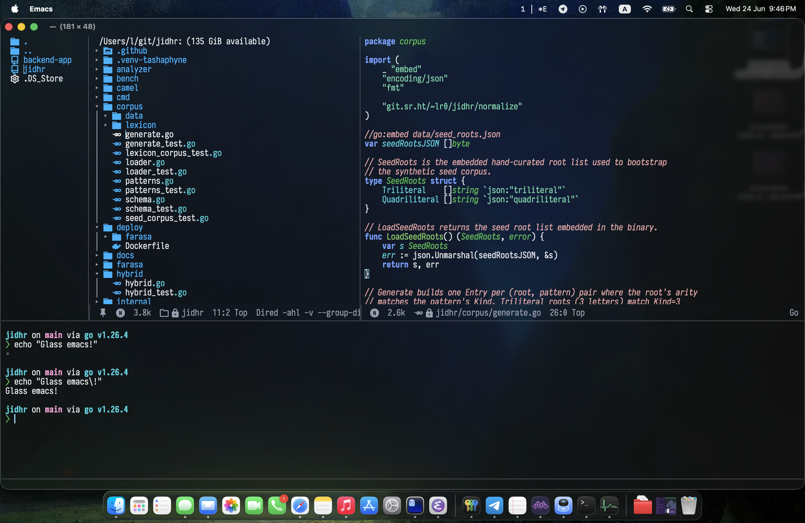

This repo is a small recipe for building Emacs with a Ghostty-like macOS glass frame: =background-opacity = 0.01= with a native =NSGlassEffectView= material.

It assumes =emacs-plus@31= from Homebrew on macOS, because the setup
layers a local patch on top of the community =frame-transparency= patch.

* Quick Start
:PROPERTIES:
:CUSTOM_ID: quick-start
:END:

Then install from your tap:

#+begin_src sh
brew tap larrasket/emacs-liquid-glass
brew emacs-liquid-glass install
#+end_src

Without copying the rebuilt app bundle into =/Applications=:

#+begin_src sh
brew emacs-liquid-glass install --no-copy-app
#+end_src

Direct clone usage also works:

#+begin_src sh
git clone https://github.com/larrasket/emacs-liquid-glass 
cd emacs-liquid-glass
./install.sh
#+end_src

The installer runs the same steps shown below:

- copies the patch to =~/.config/emacs-plus/ns-glass-effect.patch=
- copies the Homebrew config to =~/.config/emacs-plus/build.yml=
- runs =brew tap d12frosted/emacs-plus= for the underlying
  =emacs-plus@31= formula
- rebuilds =emacs-plus@31= from source
- runs =brew postinstall d12frosted/emacs-plus/emacs-plus@31=
- syncs the rebuilt app bundles into =/Applications=

Use =./install.sh --no-copy-app= if you do not want it to update
=/Applications/Emacs.app=.

** Build
:PROPERTIES:
:CUSTOM_ID: build
:END:
Copy the patch and build config:

#+begin_src sh
mkdir -p ~/.config/emacs-plus
cp patches/ns-glass-effect.patch ~/.config/emacs-plus/ns-glass-effect.patch
cp config/build.yml ~/.config/emacs-plus/build.yml
#+end_src

Build Emacs from source:

#+begin_src sh
brew tap d12frosted/emacs-plus
HOMEBREW_NO_AUTO_UPDATE=1 brew reinstall emacs-plus@31 --build-from-source
brew postinstall d12frosted/emacs-plus/emacs-plus@31
#+end_src

Update the app bundle used by =/opt/homebrew/bin/emacs=:

#+begin_src sh
rsync -a --delete /opt/homebrew/opt/emacs-plus@31/Emacs.app/ /Applications/Emacs.app/
rsync -a --delete "/opt/homebrew/opt/emacs-plus@31/Emacs Client.app/" "/Applications/Emacs Client.app/"
#+end_src

** Emacs Config
:PROPERTIES:
:CUSTOM_ID: emacs-config
:END:
Load =lisp/lr-macos-glass.el= from your config, or copy the
relevant parts into configuration.

The regular preset uses:

#+begin_src elisp
(setq salih/alpha-background 0.01
      salih/ns-background-blur 0
      salih/ns-glass-material 'regular
      salih/ns-glass-tint-opacity 0.05
      salih/ns-glass-saturation 1.4
      salih/ns-glass-inactive-opacity 0.05
      salih/ns-glass-corner-radius 2
      salih/ns-transparent-titlebar t)
#+end_src

I have not tested this configuration outside of Doom Emacs, expect the need for modifications.
